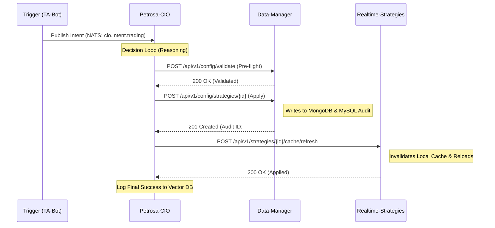

# Petrosa Autonomous Configuration Tuning (PACT) - Technical Specification

**Version**: 1.0.0  
**Status**: Draft for Review  
**Owners**: Architecture Team, Yurisa2  
**Related ADRs**: [ADR-003: CIO Intelligence Framework](../../docs/architecture/003-cio-intelligence-framework.md)

---

## 1. Executive Summary
The Petrosa CIO (Chief Investment Officer) was intended to be an autonomous intelligence layer capable of tuning trading strategies in real-time. However, the current implementation uses an asynchronous, unvalidated NATS fire-and-forget mechanism ("The Ghost Path"). This specification details the migration to a **Synchronous, Validated REST-based Control Plane** to ensure every "Intelligence Decision" is audited, validated, and successfully applied.

## 2. Architecture Comparison

| Feature | Legacy "Ghost" Path (NATS) | New "PACT" Path (REST) |
| :--- | :--- | :--- |
| **Protocol** | NATS (Asynchronous) | HTTP/REST (Synchronous) |
| **Validation** | None (Blind JSON push) | Pre-flight Schema Validation |
| **Auditing** | Fragmented / Missing | Centralized via Data Manager API |
| **Error Handling** | Fire & Forget (No ACK) | Immediate HTTP error response |
| **State Sync** | Eventual Consistency | Immediate Transactional Update |

---

## 3. High-Level Control Flow

---

## 4. Service Responsibilities

### 4.1 Petrosa-CIO (The Dispatcher)
- **Role**: Execute the LLM Reasoning loop and dispatch valid REST commands.
- **New Component**: `RESTRouter` to replace `NATSListener` for outbound config changes.
- **Fail-Safe**: If the REST call fails, the decision must be logged as "FAILED_TO_APPLY" in the Vector DB.

### 4.2 Petrosa-Data-Manager (The Archive & Proxy)
- **Role**: Centralized source of truth for strategy "DNA" (Schema + Defaults).
- **Enforcement**: Must reject any config update that violates the `ParameterSchema`.
- **Transparency**: Automatically creates a versioned audit trail for every change initiated by the CIO.

### 4.3 Realtime-Strategies / TA-Bot (The Executioners)
- **Role**: Run the trading logic and maintain low-latency caches.
- **Trigger**: Listen for the `/cache/refresh` REST call from the CIO/DM.
- **Fallback**: Maintain the 60s background refresh as a secondary safety net.

---

## 5. Implementation Roadmap (The 16-Step Loop)

### Phase 1: Preparation & Discovery
1. **Cataloging**: Enumerate all strategy schemas in `defaults.py` to ensure the CIO has the "Map" of what it can tune.
2. **Environment**: Inject `SERVICE_URLS` into the CIO Kubernetes deployment.

### Phase 2: Building the REST Bridge
3. **Refactor Router**: Modify `cio/core/router.py` to use `httpx` instead of `nats-py` for `ActionType.MODIFY_PARAMS`.
4. **Validation Logic**: Implement the "Pre-flight" check against the Data Manager.
5. **Security**: Add `X-Petrosa-Issuer: CIO` headers to identify autonomous changes in the audit logs.

### Phase 3: Decommissioning the "Ghost"
6. **Feature Flag**: Enable "REST-Tuning" via environment variable.
7. **Observer Mode**: Run changes through REST but keep NATS as a secondary log (for 48 hours).
8. **Hard Cut**: Remove the `strategy.config.update` NATS publishing logic entirely.

---

## 6. Safety & Guardrails
- **The 10% Clamp**: The blunt ±10% multiplier will be replaced with a `QuantAnalyst` suggested range, but capped by the `ParameterSchema` hard limits.
- **Circuit Breakers**: If a strategy fails its health check after a tuning update, the CIO will automatically trigger a `POST /rollback`.
- **Dry Run Support**: Every tuning action can be run with `validate_only=true` for non-destructive testing.
